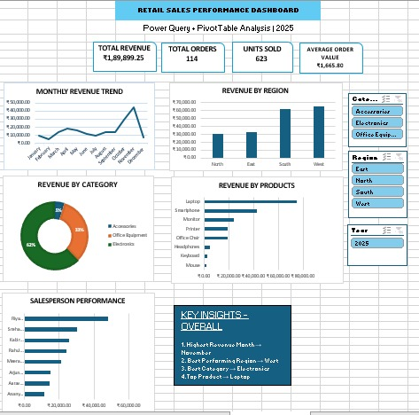

# Excel Power Query Retail Sales Dashboard

This project is a retail sales analysis dashboard that I built in Microsoft Excel to practice working with real-world style sales data.
I used Power Query to clean and prepare the raw data, then used PivotTables, PivotCharts, formulas, and slicers to turn the cleaned data into an interactive dashboard.

The main goal was to understand how sales were performing across different months, regions, products, categories, and salespeople.

## Dashboard Preview

## What I Worked On

The project started with a raw retail sales dataset containing information such as:

- Transaction ID
- Order Date
- Customer Name
- Region
- Salesperson
- Product
- Category
- Units
- Unit Price
- Discount
- Payment Method
- Notes
- Internal Flag

I cleaned and prepared the data in Power Query before using it for analysis.

## Data Cleaning with Power Query

Some of the cleaning and transformation steps I worked on include:

- Removed completely blank rows
- Removed duplicate records
- Cleaned extra spaces from text fields
- Standardized text formatting
- Handled missing values
- Cleaned the Discount column
- Created a Clean Discount column
- Changed columns to appropriate data types
- Created Year and Month fields from Order Date
- Added a Total Revenue calculation
- Reordered and renamed columns where needed

After cleaning, the dataset contained **114 usable records** for the analysis.

## Charts Included

The dashboard contains five different views of the sales data:

- **Monthly Revenue Trend** – shows how revenue changed throughout the year
- **Revenue by Region** – compares sales across East, North, South, and West
- **Revenue by Category** – shows the contribution of each product category
- **Revenue by Products** – compares revenue generated by individual products
- **Salesperson Performance** – compares sales performance across salespeople

## Interactive Filters

I also added slicers for:

- Category
- Region
- Year

These allow the dashboard to be filtered interactively and make it easier to explore specific parts of the dataset.

## Key Insights

A few observations from the analysis were:

- **November** had the highest monthly revenue.
- **West** was the highest-performing region overall.
- **Electronics** generated the highest revenue among the categories.
- **Laptop** was the top product by revenue.
- Revenue and salesperson performance varied noticeably across different regions and products.

## Tools Used

- Microsoft Excel
- Power Query
- PivotTables
- PivotCharts
- Excel Formulas
- Slicers

## What I Learned

This project helped me get more comfortable with the complete process of working with a dataset in Excel — starting from raw data cleaning in Power Query and ending with an interactive dashboard.

It also gave me more practice in choosing the right charts, creating useful KPIs, and looking at the data from a business perspective rather than just creating tables.

## Author

**Vruttika Sawant**

Aspiring Data Analyst | Excel | SQL | Python | Power BI
